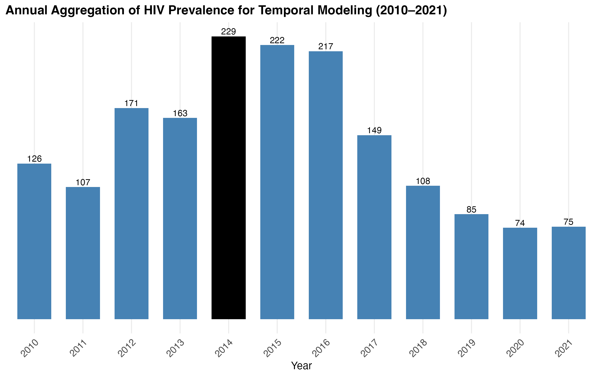
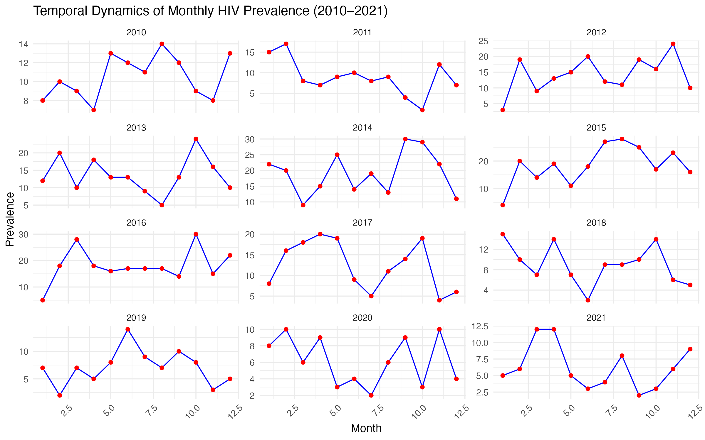
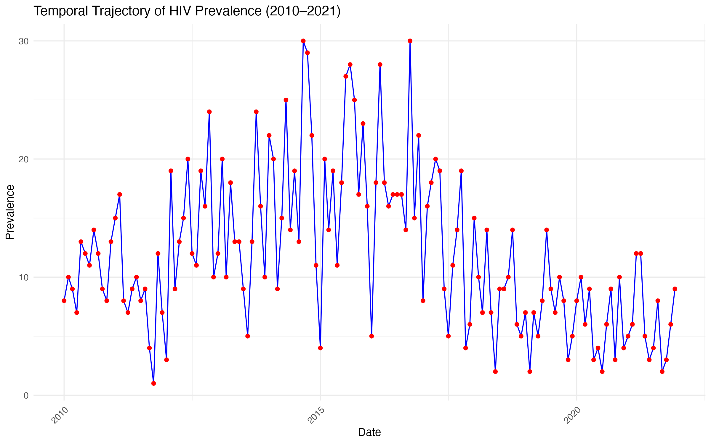
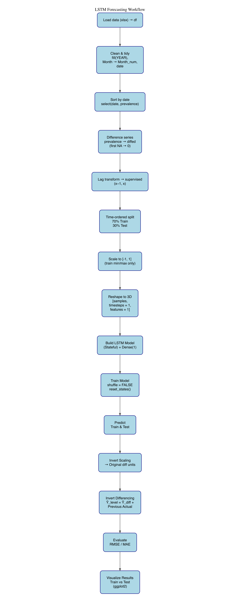
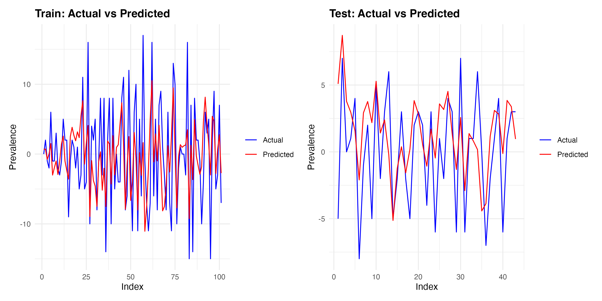

# 📊 Deep Learning-Based Forecasting of HIV Prevalence Using Long Short-Term Memory Networks

  
  
  
  
  

---

## Overview

Forecasting infectious disease burden is essential for public health planning, resource allocation, and healthcare decision-making. While traditional statistical forecasting methods remain widely used in epidemiology, their assumptions may limit their ability to capture complex temporal dependencies in disease dynamics.

This project investigates the application of a **Long Short-Term Memory (LSTM)** neural network to forecast HIV prevalence using monthly epidemiological observations collected between **2010 and 2021**. The study evaluates whether a lightweight recurrent architecture can learn meaningful temporal patterns from a limited univariate dataset while maintaining reproducibility and interpretability.

---

## Research Question

> **Can a parsimonious LSTM architecture effectively model and forecast HIV prevalence dynamics in a small-sample epidemiological setting?**

Specifically, this work examines whether recurrent neural networks can capture non-linear temporal relationships that may be difficult to represent using conventional forecasting approaches.

---

## Dataset

| Characteristic | Description |
|---------------|-------------|
| Time Period | 2010–2021 |
| Frequency | Monthly |
| Outcome | HIV Prevalence |
| Data Type | Univariate Time Series |
| Domain | Epidemiology / Public Health |

### Modeling Challenges

- Limited sample size
- Temporal dependence
- Non-stationary behavior
- Irregular fluctuations
- No exogenous predictors

These characteristics motivated the use of a carefully constrained modeling framework emphasizing stability and generalization.

---

# Exploratory Data Analysis

### Annual HIV Prevalence Aggregation

  

### Monthly Dynamics by Year

  

### Temporal Evolution of HIV Prevalence

  

The exploratory analysis reveals substantial temporal variability and evolving prevalence patterns over time, motivating the use of sequence-learning approaches capable of capturing both short- and long-range dependencies.

---

# Modeling Workflow

The complete forecasting framework is summarized below.

  

### Workflow Summary

1. Data cleaning and temporal alignment
2. First-order differencing
3. Supervised sequence construction
4. Chronological train–test partitioning
5. Min–max normalization
6. Stateful LSTM training
7. Forecast reconstruction
8. Performance evaluation

To preserve methodological rigor, all preprocessing statistics were estimated exclusively from the training data, preventing information leakage during model evaluation.

---

# LSTM Architecture

A lightweight stateful Long Short-Term Memory network was implemented to model temporal dependence in the prevalence series.

| Component | Specification |
|------------|--------------|
| Input Features | 1 |
| LSTM Units | 8 |
| Dense Output Layer | 1 |
| Batch Size | 1 |
| Epochs | 50 |
| Optimizer | Adam |
| Learning Rate | 0.001 |
| Loss Function | Mean Squared Error |

The architecture was intentionally designed to remain simple given the limited size of the dataset while preserving sufficient capacity to learn sequential dependencies.

---

# Results

## Forecast Performance

Model performance was evaluated using:

- Root Mean Squared Error (RMSE)
- Mean Absolute Error (MAE)

The model demonstrated stable predictive behavior, with test-set performance comparable to training performance, suggesting limited overfitting and reasonable generalization.

---

## Actual vs Predicted HIV Prevalence

  

The reconstructed forecasts closely follow the observed prevalence trajectory, indicating that the model successfully captures dominant temporal patterns despite the limited sample size.

---

# Key Findings

- LSTM networks can learn meaningful epidemiological dynamics from relatively small datasets.
- Chronological train–test splitting is essential for realistic forecasting evaluation.
- Differencing and normalization substantially improve training stability.
- Forecast reconstruction is necessary for interpretation on the original prevalence scale.
- Simple architectures can provide robust forecasting performance when data availability is limited.

---

# Limitations

- Single-site dataset
- Univariate forecasting framework
- Limited temporal coverage
- Absence of demographic, clinical, and environmental predictors

These limitations should be considered when interpreting model performance and generalizability.

---

# Future Directions

Potential extensions include:

- Integration of demographic and clinical covariates
- Multivariate forecasting frameworks
- Benchmarking against ARIMA, Prophet, and Transformer-based models
- Probabilistic forecasting and uncertainty quantification
- Deployment through an interactive analytical dashboard

---

# Reproducibility

All preprocessing, model training, evaluation, and visualization steps are fully reproducible within this repository.

---

## Author

### Daniel Oluwafemi Olofin

**Computational Biostatistics • Machine Learning • Computational Oncology**

- GitHub: https://github.com/Olofin98
- Portfolio: https://olofin98.github.io/Daniel.github.io

> *Leveraging statistical learning and artificial intelligence to advance biomedical discovery and precision healthcare.*
